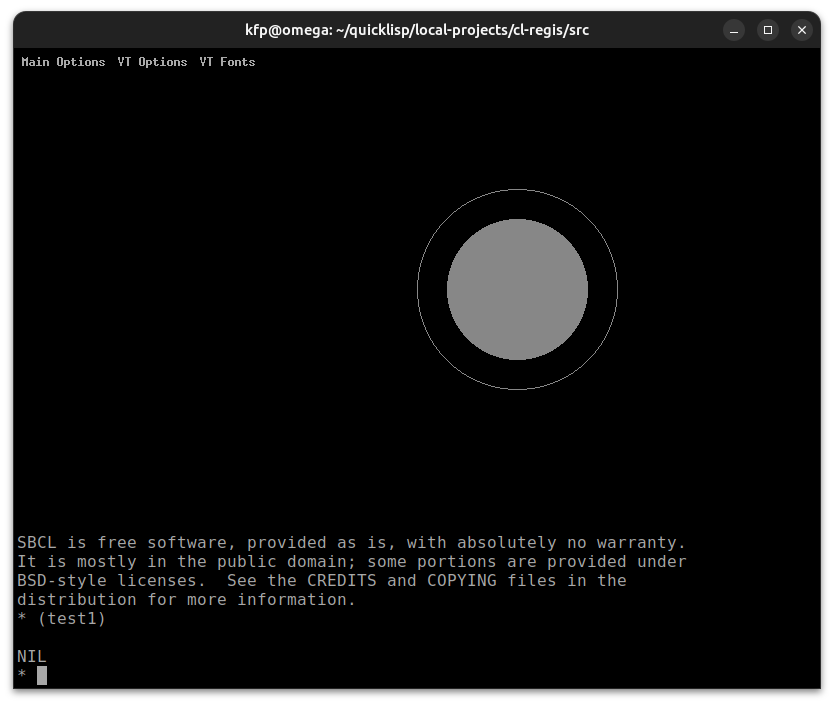
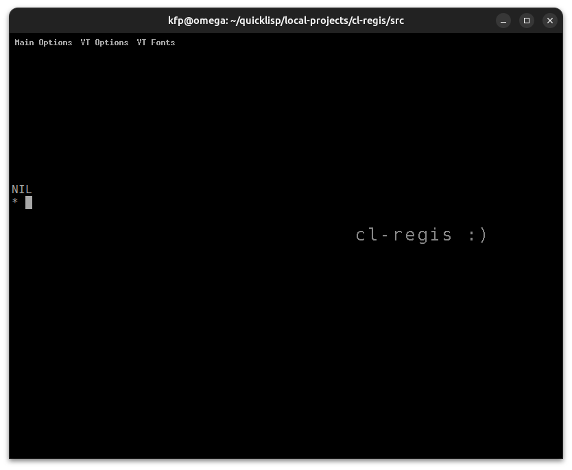
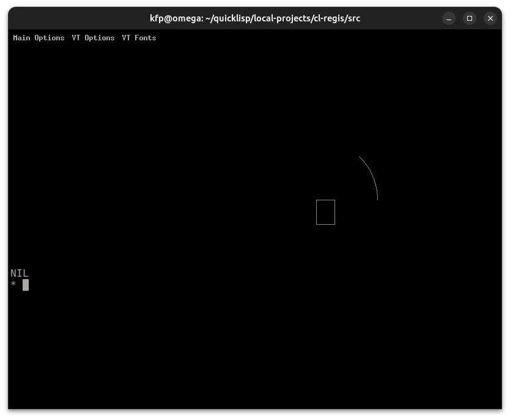
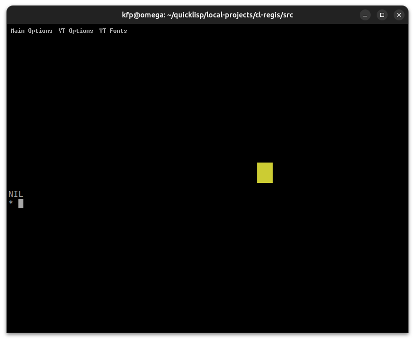
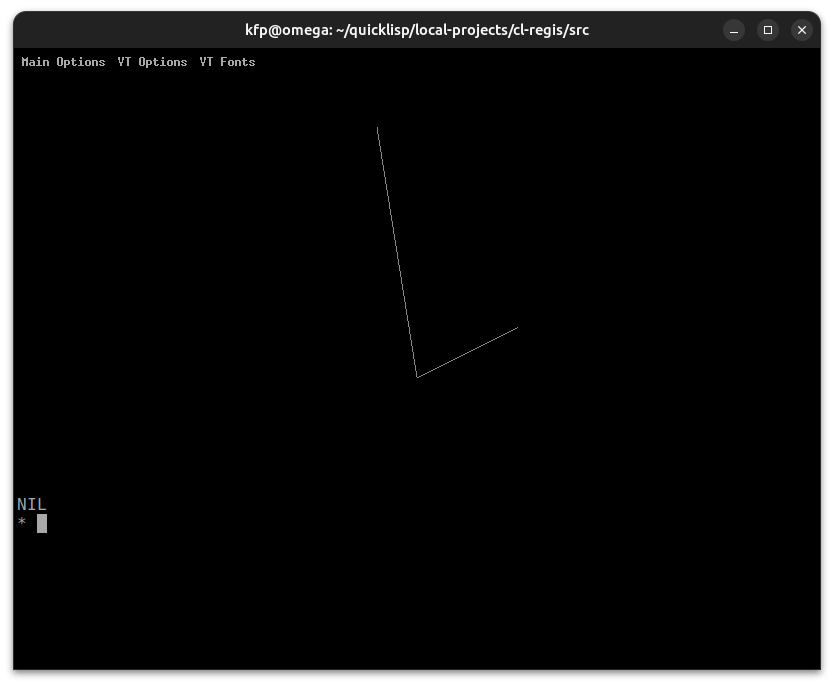

# cl-regis
ReGIS in Common Lisp

:warning: work in progress :construction:

This is for now a prototype only, inspired by https://github.com/feilipu/ReGIS.

Citing from the VT330/VT340 Graphics Programming Manual[^1]:

ReGIS is a graphics instruction set from Digital[^2]. ReGIS provides a set of commands you can use to draw images on the screen.

Of course, those terminals are hardly in use today, however, there still are some terminal emulations that support ReGIS graphics. Besides some commercial ones, we are only aware of good old  **XTerm**, however, it must be compiled with `--enable-regis-graphics` contrary to **Sixel**[^3] support which is enabled by default. This is, however, no big deal (see below).

## More info about ReGIS
* https://en.wikipedia.org/wiki/ReGIS
* http://www.sizecoding.org/wiki/ReGIS
* https://vt100.net/docs/vt3xx-gp/chapter1.html
* https://en.wikipedia.org/wiki/VT320

## Compiling xterm with ReGIS support
Borrowed from https://github.com/feilipu/ReGIS:

    $ sudo apt install -y libxaw7-dev libncurses-dev libxft-dev
    $ wget https://invisible-island.net/datafiles/release/xterm.tar.gz
    $ tar xf xterm.tar.gz
    $ cd xterm-XXX
    $ ./configure --enable-regis-graphics
    $ make
    $ sudo make install
    

Also see https://github.com/nilqed/xterm-regis

## Testing
We will try the following two examples:

The string from https://github.com/feilipu/ReGIS:

    (defvar regis-ex1 (concatenate 'string
    "S(E)W(I(M))P[600,200]V[][-200,+200]V[][400,100]W(I(G))P[700,100]"
    "V(B)[+050,][,+050][-050,](E)V(W(S1))(B)[-100,][,-050][+100,](E)V(W(S1,E))"
    "(B)[-050,][,-025][+050,](E)W(I(C))P[200,100]C(A-180)[+100]C(A+180)[+050]"
    "W(I(B))P[200,300]C(W(S1))[+100]C(W(S1,E))[+050]W(I(W))T(S02)\"hello world\""))

and the sample from Wikipedia https://en.wikipedia.org/wiki/ReGIS:

    (defvar regis-ex2 
    "S(E)(C1)P[100,440]V(B),[+100,+0],[+0,-10],[-100,+0],(E)P[500,300],F(C[+100])")
    
Note that the `begin` and `end` control sequences were removed. Those have to be added, as can be seen from the following code that is used for the examples:

    (defun rbeg () (format t "~C~C~C~C" #\Esc #\P #\1 #\p))
    (defun rend () (format t "~C~C" #\Esc #\\))

    (defun ex1 ()
      (progn (rbeg)(format t "~A" regis-ex1)(rend)))

    (defun ex2 ()
      (progn (rbeg)(format t "~A" regis-ex2)(rend)))

Running `(ex1)`:

Running `(ex2)`:

## cl-regis.lisp

You will find the file `cl-regis.lisp` in the `src` directory. It is just
a POC for the moment.

    begin .............. enter ReGIS  
    end ................ end ReGIS

    setpos (x y) ....... set position (pixels). Origin is left upper corner.
    circle (r) ......... draw a circle with radius r at current position.
    circlef (r) ........ draw a filled circle.
    clear () ........... clear the ReGIS buffer.

    pixela (x y) ....... draw a pixel at (x,y).
    pixelr () .......... draw a pixel relative to current position.
    mover (dx dy) ...... move relative (dx,dy) to current position.
    text (txt size) .... draw text 'txt' with size 'size'.

    arc (deg r) ........ draw an arc with radius r and opening angle deg.
    box (w h) .......... draw a box w wide an h height.
    boxf (w h) ......... draw a filled box.
    regis (cmd) ........ enter any ReGIS command 'cmd'

    color (c) .......... set coolor c
    lineato (x y) ...... draw a line to absolute position (x,y).
    linerto (dx dy) .... draw a line to relative position (dx,dy).
    wstyle (s) ......... set the write sryle.
    mroffd(d offset) ... move relative offset.
    setposr (dx dy) .... set position relative.
    pat (p) ............ set pattern p.
    
    
For details consult the VT* manual.

### tests

#### test1
Set position 500,250 and draw two circles (one filled).

    (defun test1 ()
       (progn (begin) (clear) (setpos 500 250) (circle 100) (circlef 70) (end)))

#### test2
Set position 500,250 and draw a text.

    (defun test2 ()
       (progn (begin) (clear) (setpos 500 250) (text "cl-regis :)" 2) (end)))
  
  

#### test3
Set position 500,250 and draw an arc and a box.

    (defun test3 ()
       (progn (begin) (clear) (setpos 500 250) (arc 45 100) (box 30 40) (end)))
  

#### test4
Set position 500,250 and draw a yellow box.

    (defun test4 ()
       (progn (begin) (clear) (setpos 500 250) (color "Y") (boxf 30 40) (end)))

#### test5
Set position 500,250 and draw two lines. One absolute to 400,300 and one
relative (-40,50).

    (defun test5 ()
       (progn (begin) (clear) (setpos 500 250) (lineato 400 300) (linerto -40 50) (end)))

:todo:

Interface with some great libraries like 
VECTO[^4], CL-VECTORS[^5] and so on. 

:date:

[^1]: http://bitsavers.trailing-edge.com/pdf/dec/terminal/vt340/EK-VT3XX-GP-001_VT330_VT340_Graphics_Programming_Mar87.pdf
[^2]: https://en.wikipedia.org/wiki/Digital_Equipment_Corporation
[^3]: https://github.com/nilqed/cl-sixel
[^4]: https://www.xach.com/lisp/vecto/ 
[^5]: https://projects.tuxee.net/cl-vectors/ 

