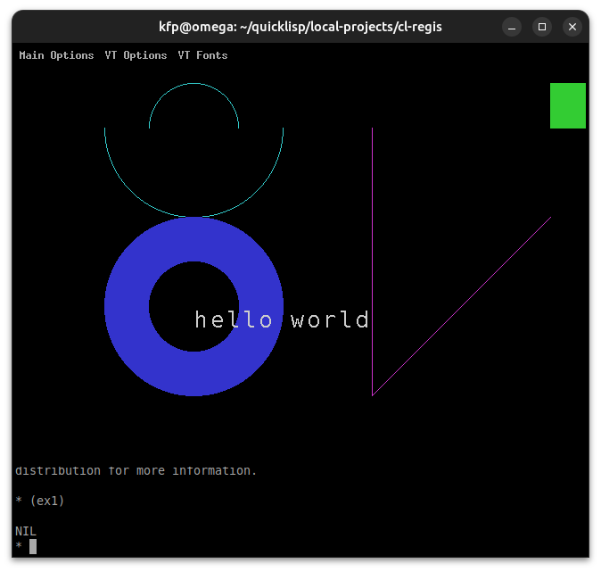
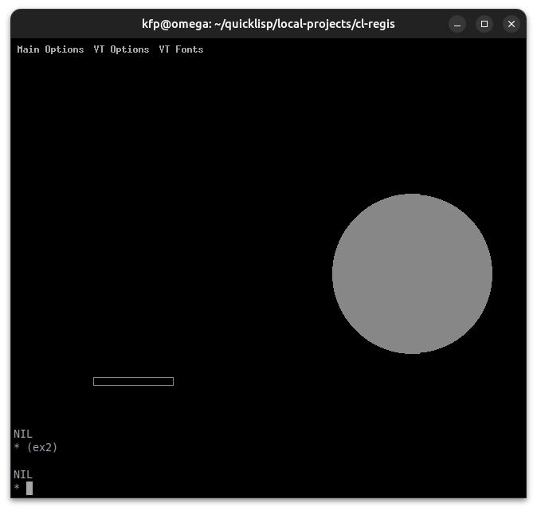

# cl-regis
ReGIS in Common Lisp

:warning: work in progress :construction:

This is for now a prototype only inspired by https://github.com/feilipu/ReGIS.

Citing from the VT330/VT340 Graphics Programming Manual[^1]:

ReGIS is a graphics instruction set from Digital[^2]. ReGIS provides a set of commands you can use to draw images on the screen.

Of course, those terminals are hardly in use today, however, there still are some terminal emulations that support ReGIS graphics. Besides some commercial ones, we are only aware of good old  **XTerm**, however, it must be compiled with `--enable-regis` contrary to **Sixel** support which is enabled by default. This is, however, no big deal (see below).

## More info about ReGIS
* https://en.wikipedia.org/wiki/ReGIS
* http://www.sizecoding.org/wiki/ReGIS
* https://vt100.net/docs/vt3xx-gp/chapter1.html
* https://en.wikipedia.org/wiki/VT320

## Compiling xterm with ReGIS support
See also https://github.com/feilipu/ReGIS:

``
    $ sudo apt install -y libxaw7-dev libncurses-dev libxft-dev
    $ wget https://invisible-island.net/datafiles/release/xterm.tar.gz
    $ tar xf xterm.tar.gz
    $ cd xterm-392
    $ ./configure --enable-regis-graphics
    $ make
    $ sudo make install
``

Although *ReGIS, short for Remote Graphic Instruction Set*, we will not use an USART but
rather print directly to the screen with `(format ...)`. 

## Testing
We will use the following two examples:

The string from https://github.com/feilipu/ReGIS:

    (defvar regis-ex1 (concatenate 'string
    "S(E)W(I(M))P[600,200]V[][-200,+200]V[][400,100]W(I(G))P[700,100]"
    "V(B)[+050,][,+050][-050,](E)V(W(S1))(B)[-100,][,-050][+100,](E)V(W(S1,E))"
    "(B)[-050,][,-025][+050,](E)W(I(C))P[200,100]C(A-180)[+100]C(A+180)[+050]"
    "W(I(B))P[200,300]C(W(S1))[+100]C(W(S1,E))[+050]W(I(W))T(S02)\"hello world\""))

and the sample from Wikipedia https://en.wikipedia.org/wiki/ReGIS:

    (defvar regis-ex2 
    "S(E)(C1)P[100,440]V(B),[+100,+0],[+0,-10],[-100,+0],(E)P[500,300],F(C[+100])")
    
Note that the `begin` and `end` control sequence were removed. Those hase to be added, as can be seen from the following code:

    (defun rbeg () (format t "~C~C~C~C" #\Esc #\P #\1 #\p))
    (defun rend () (format t "~C~C" #\Esc #\\))

    (defun ex1 ()
      (progn (rbeg)(format t "~A" regis-ex1)(rend)))

    (defun ex2 ()
      (progn (rbeg)(format t "~A" regis-ex2)(rend)))

Running `(ex1)`:

Running `(ex2)`:

:date:

[^1]: http://bitsavers.trailing-edge.com/pdf/dec/terminal/vt340/EK-VT3XX-GP-001_VT330_VT340_Graphics_Programming_Mar87.pdf
[^2]: https://en.wikipedia.org/wiki/Digital_Equipment_Corporation

